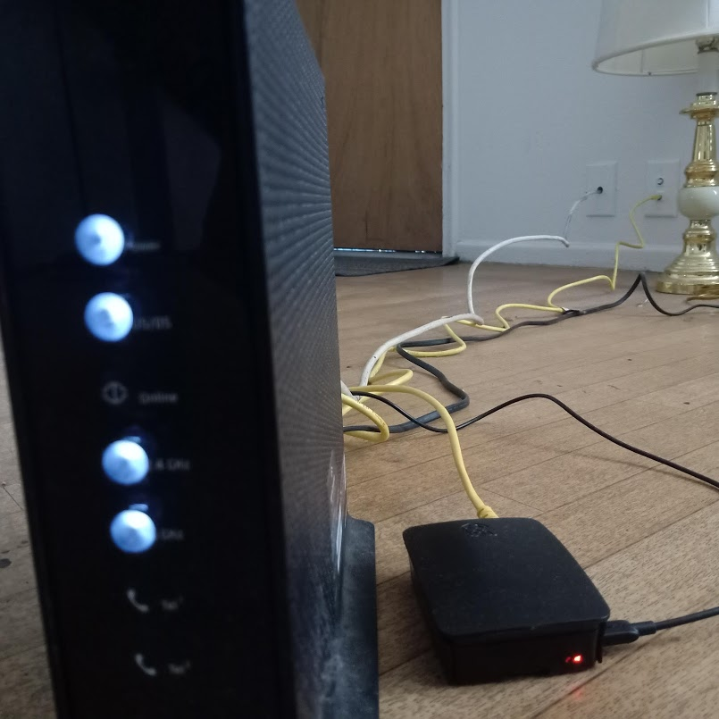
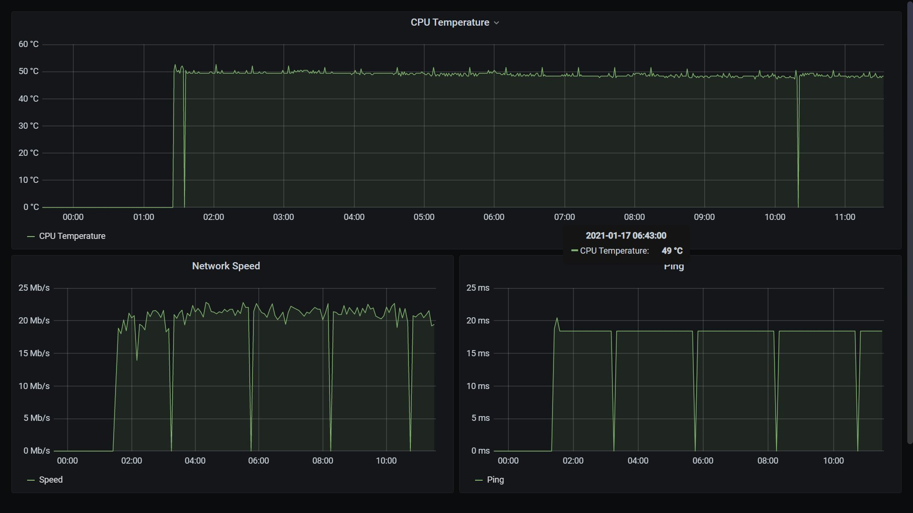

# :computer: Raspi Influx-Grafana Dashboard

Out of many uses and purposes that InfluxDB is used for, Sensor data monitoring is an application that's easy to setup and use on most linux enabled devices. (except for a few port allocation :confused: issues when you have other services running with same default ports)

Couple it with grafana for visualisations, you've got yourself a dashboard that has most of what you need to see.

This project is setup on a raspberrypi to use on the local network.



## :point_right: First things first

### :gear: Setup

- Install [influxdb-oss](https://docs.influxdata.com/influxdb/v1.8/introduction/install/) - the timeseries database for ingest
  > As mentioned before, one of the common troubles one might run into whilst starting influxdb for the first time is that the database server fails to run properly pointing to an port mis/pre allocation issue. Given it's a common issue, one can find answers on influxdb's community forum/stackoverflow. (:sparkling_heart: community)
- Install [grafana](https://grafana.com/docs/grafana/latest/installation) the visualisation tool for dashboards.
- Install [gnu-screen](https://gnu.org/software/screen) - terminal multiplexer (more about it below)
- Setup python requirements from the `requirements.txt` using

  ```bash
  pip install -r requirements.txt
  ```

  > I'm using `virtualenv` with python3.8 on my raspberrypi, anything above 3.6 is a viable option given that the `arm` versions of those packages are available.

### :running: Dry Running Influx and Grafana

Once the influxdb, grafana are setup and running, head to the grafana dashboard and the default `_internal` tsdb as the datasource. Once you've seen a notification from Grafana saying that the datasource is working, proceed to the terminal and create a new database.

```sh
$ influx
> show databases
  _internal
> create database <name/of/your/db>
> use <name/of/your/db>
> show measurements
```

> - The last command would typically result in nothing given that it's a freshly created database.
> - Also makesure that you replace the name of the db in the script appropriately.

## :point_right: Using the script

- Run a screen session

```bash
screen -x
```

This launches a new screen session.
You can now run the python script either by changing the permissions on the setting the script to executable. you can do so by

```bash
sudo chmod +x scripts/monitor.py
```

Run the script either by doing

```bash
(env)$ python scripts/monitor.py
```

or

```bash
(env)$ ./scripts/monitor.py
```

The script has logging setup and they're printed out to `stdout`. If you wish to bypass this/store them to a file, either change the logging settings or do a

```bash
(env)$ nohup python scripts/monitor.py > logfile.log
```

## :chart: Grafana Dashboard Setup


TBD